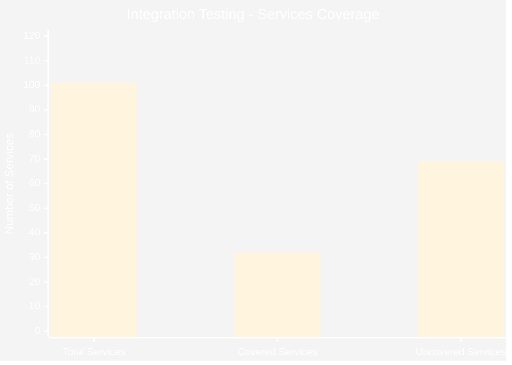
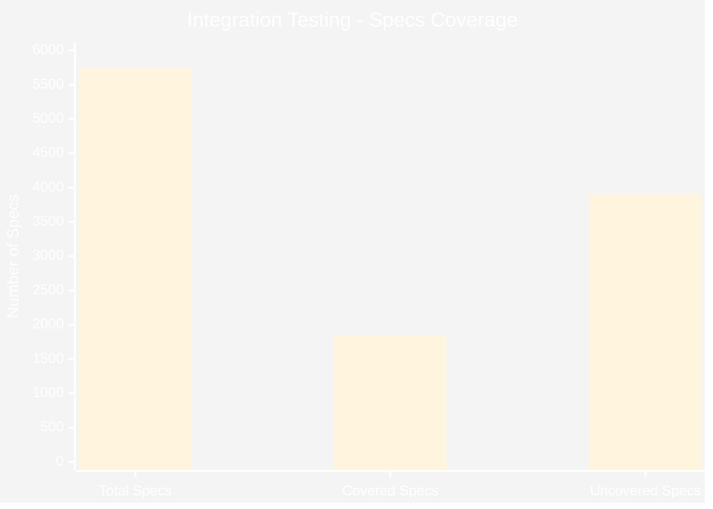
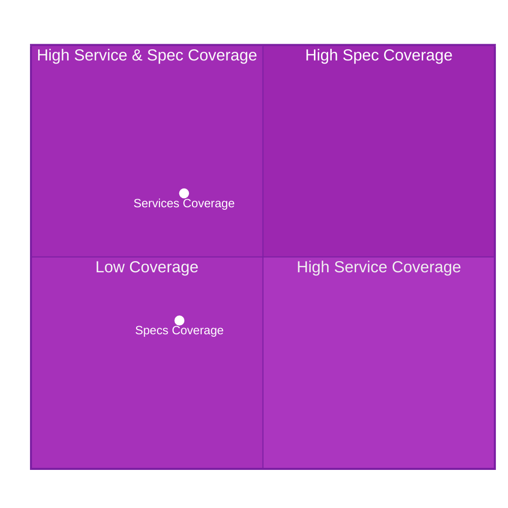
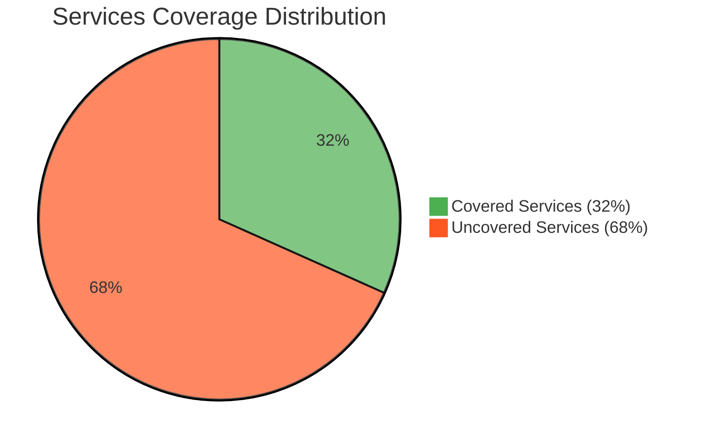
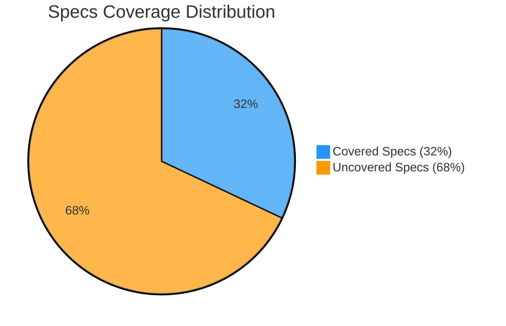

# Integration Testing Coverage Analysis

## Bar Chart - Services Coverage

## Bar Chart - Specs Coverage

## Radar Chart - Overall Coverage Metrics

## Pie Chart - Services Coverage Distribution

## Pie Chart - Specs Coverage Distribution

## Coverage Summary Table

| Metric | Total | Covered | Coverage % | Status |
|--------|-------|---------|------------|--------|
| **Services** | 101 | 32 | 32.0% | 🟡 Needs Improvement |
| **Specs** | 5,734 | 1,836 | 32.0% | 🟡 Needs Improvement |

## Key Insights

### Services Coverage (32%)
- **Total Services**: 101
- **Covered Services**: 32
- **Gap**: 69 services need integration tests

### Specs Coverage (32%)
- **Total Specs**: 5,734
- **Covered Specs**: 1,836
- **Gap**: 3,898 specs need integration tests

### Priority Areas for Improvement
1. **Critical Services**: Focus on core services like internal-app, external-app, parser
2. **High-Impact Specs**: Prioritize frequently used specifications
3. **Service Dependencies**: Cover services that are dependencies for other services

### Coverage Goals
- **Short-term**: Achieve 50% service coverage (49 services)
- **Medium-term**: Achieve 60% spec coverage (3,441 specs)
- **Long-term**: Achieve 80% overall coverage across both metrics
